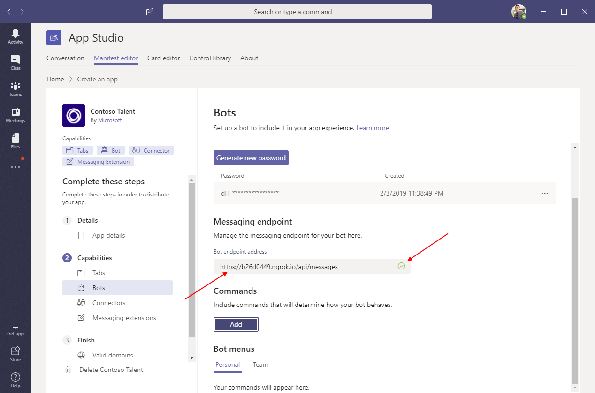
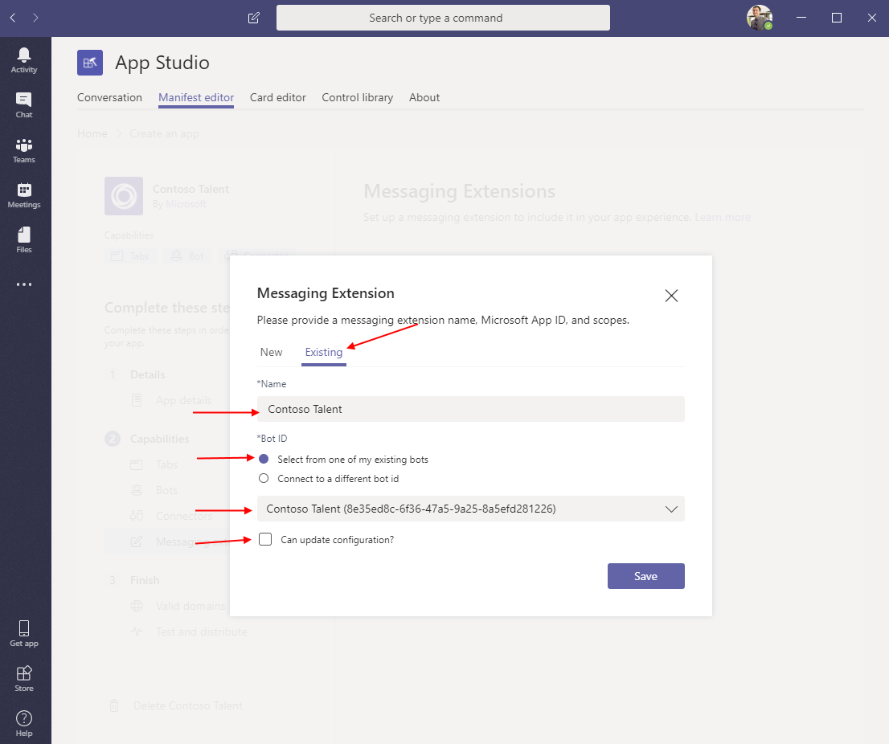
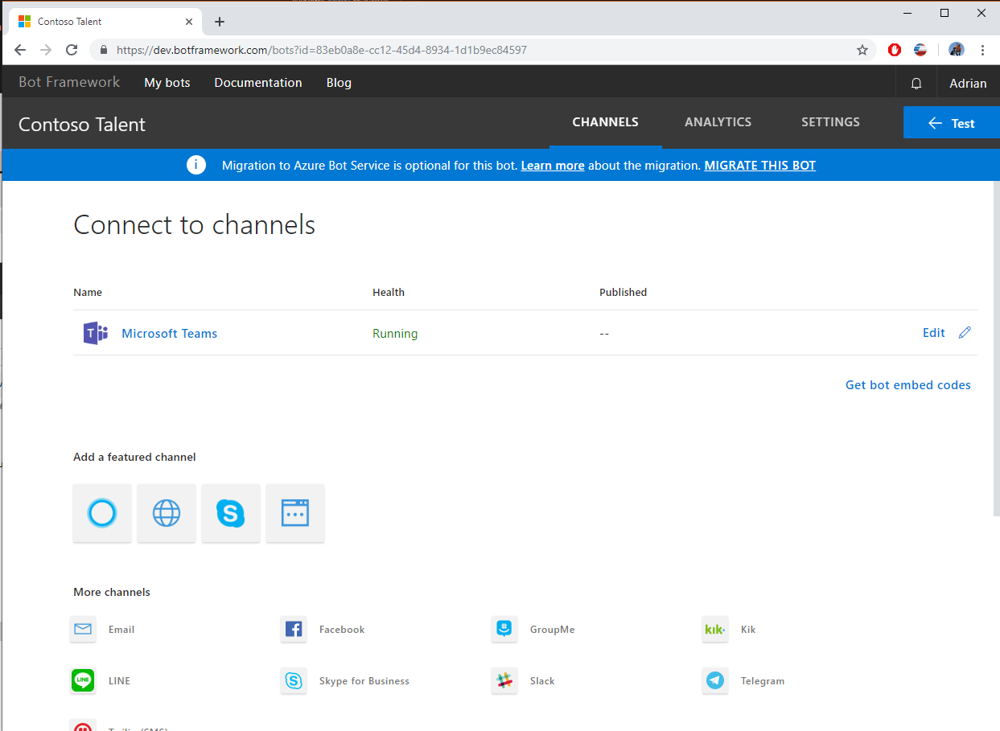
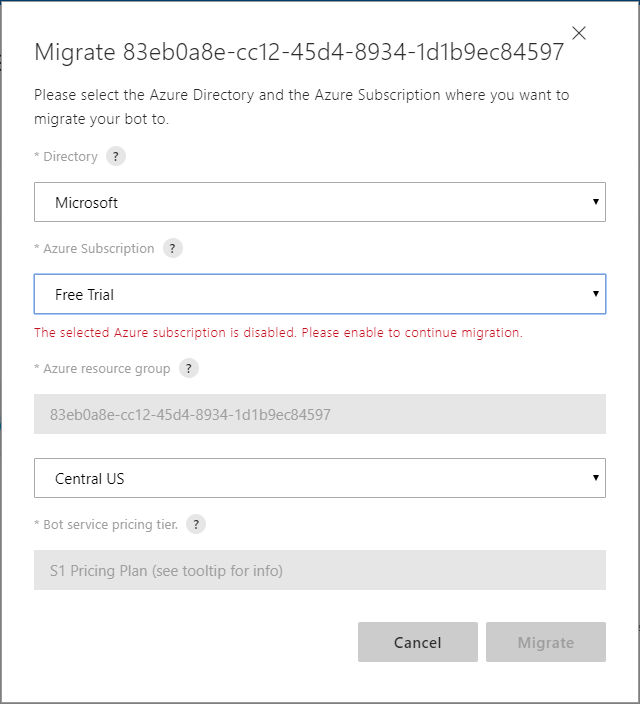
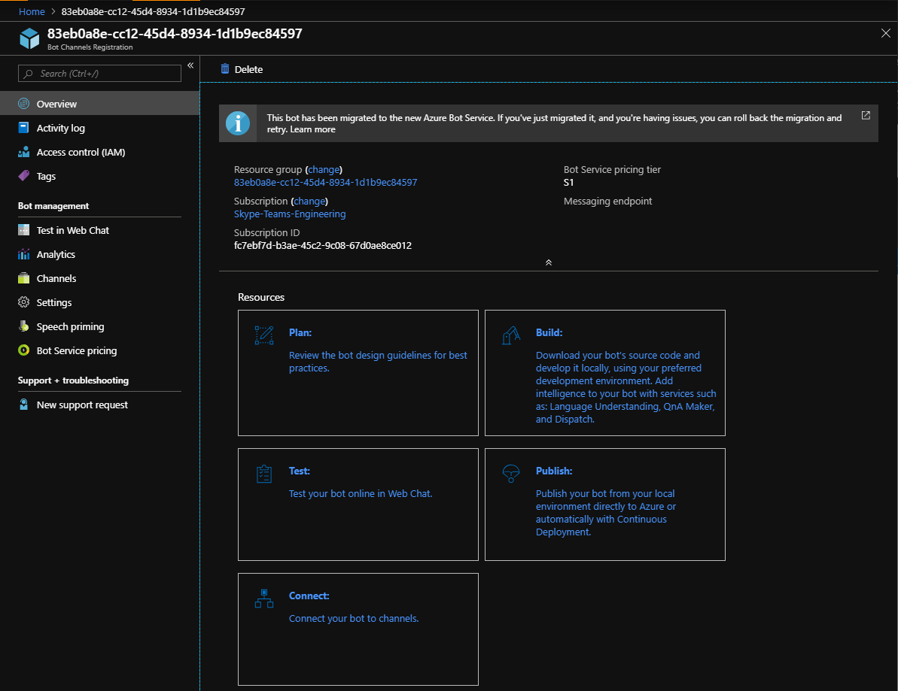
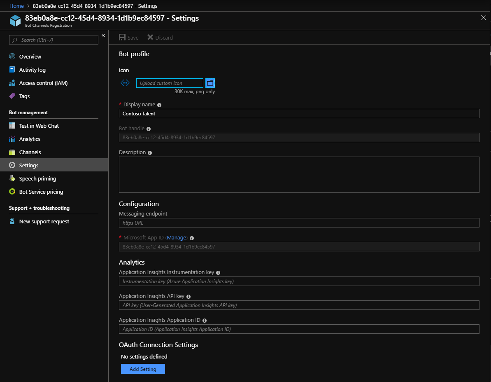
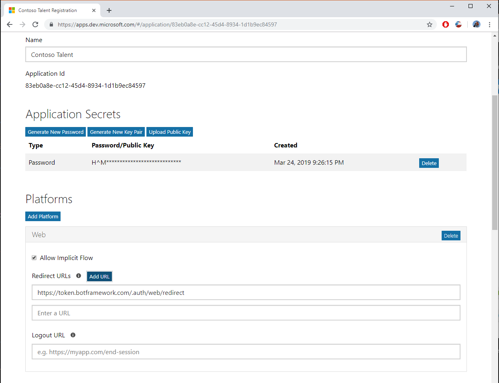
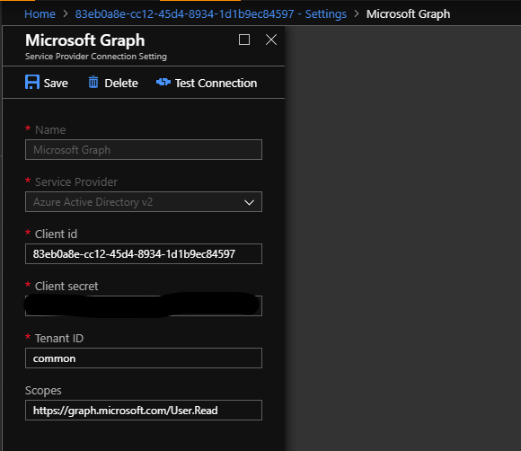
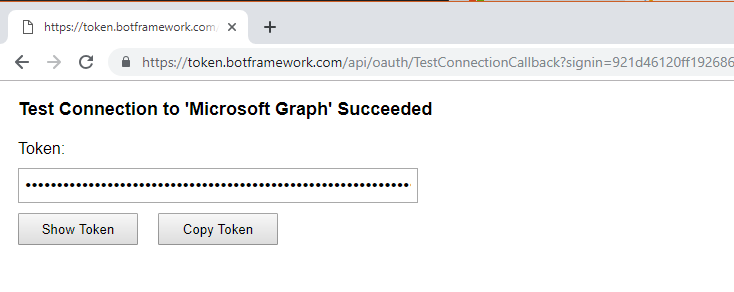

# 0-60: Get up and running with your very first Microsoft Teams app

## Overview and Introduction
In this lab, you will be getting your first app up and running in Teams. You should do this lab if:
- You have used Microsoft Teams
- You are interested in building apps or solutions for Teams, or Office 365 in general
- You have built Add-ins for Office or SharePoint

We will start with an app that provides basic bot and tab functionality already hosted on Azure. The lab will then include instructions for adding new functionality through the app’s manifest. For those who want to go further, you can add enhancements to the bot and deploy those changes to your own Azure subscription. 

The sample app we're using here manages the hiring process of candidates for open positions in a team – a Talent Management Application. While it looks good, the app doesn't actually do anything – we want to focus on building a Teams app and loading it into Teams, not creating a full-blown talent management application.

## Prerequisites
### Development tools
Please come with the following tools installed on your laptop:
- [Ngrok](https://ngrok.com/)
    - We recommend signing up for an account. Otherwise your tunnel will time out periodically and you will need to restart ngrok. Each time you restart, the tunnel endpoint changes.
- Visual Studio 2017
    - Install the "ASP.NET and web development" workload
- Microsoft Teams desktop client
- Browser of your choice

### Prepare your Office 365 environment
**IMPORTANT!** You must have an Office 365 tenant to complete this lab. If you don't have one, you can sign up for an Office 365 developer subscription by following the instructions [here](https://docs.microsoft.com/en-us/office/developer-program/office-365-developer-program-get-started).

>**IMPORTANT!** Because of limitations in Teams App Studio, a Microsoft Teams free tenant will **not** work for this lab. 

You will first need to enable side loading for Teams within your Office 365 environment. Open the Admin Center by visiting https://admin.microsoft.com/AdminPortal/Home#/Settings/ServicesAndAddIns from your browser.

Next, select Microsoft Teams. Under the Apps section, scroll down to External Apps and make sure that “Allow sideloading of external apps” is set to On.


# PART 1: Your first Teams app
In this first part of the Lab you’re going to create a Teams app using an existing base manifest.

## Step 1: Get the code and the base app package
First, you’ll need to grab the source code, which is located in the **microsoft-teams-sample-talent-acquisition** folder with this lab.

Open the solution in Visual Studio by double-clicking on the .sln file. Restore NuGet packages, then verify that the solution builds. Once you have it building, you can leave Visual Studio alone for now&mdash;we'll come back to it later.

You will also need the base app manifest, **teams-sample-app-package.zip**. Download it to your PC and unzip the contents to any local folder. It will contain three files:
- manifest.json
- color_icon.png
- outline_icon.png

## Step 2: Create your app using Teams App Studio
Open the Teams desktop client and log in with your test tenant's credentials. You can play around with Teams and create your own teams and channels.

To create the app package, Teams has a tool called App Studio&mdash;and it's actually a Teams app itself. Install it from the Teams app store:


Click on the "Store" icon at the lower left, search for "app studio", click on the "Teams App Studio" entry, "Install" button on the consent dialog, and then the bottom "Open" button on the second next dialog:

 

Click on the "Manifest editor" tab and the "Import an existing app" button:


Load the **teams-sample-app-package.zip** file that you previously unzipped and then click on the "Contoso Talent" entry.


## Step 3: Add a bot to the sample manifest
 
Most of the information has already been filled out for you. The following screenshots show what information to change:

### App Details
Click on the "Generate" button to generate a unique app id.


### Bots
Go to the "Bots" section in the manifest editor, then click on "Set up" to start.

In the dialog that appears, select "New bot" and name it "Contoso Talent". Under "Scope" select "Personal" and "Team". Leave the rest of the checkboxes unchecked.


Then click on "Create bot" and wait as App Studio registers a new bot with the Microsoft Bot Framework.

The dialog will close and you'll be back on the "Bots" page. Notice that a new bot has been created. Select the app id, press Ctrl-C to copy it, and paste the id into Notepad. You'll need this ID later!


Then click on "Generate new password". Select and copy the password that is generated, then paste it into Notepad. Just like the app id, you'll need the password later.


The "messaging endpoint" is the HTTP endpoint where your bot will receive messages sent to it. Leave this blank for now&mdash;we'll come back to it later.

## Step 4: Set your App ID and Password
Return to Visual Studio and open the Web.config file at the root of the solution. In the TeamsAppId/MicrosoftAppId/MicrosoftAppPassword sections, copy/paste the App ID and Password from Notepad. TeamsAppId doesn't have to be the same as MicrosoftAppId, but it's usually easier if it is, so use the same App ID for both. When you are done, it should look like this:


Save the Web.config file.

## Step 5: Tunnel localhost to the Internet
Although a Microsoft Teams app is free to access information and APIs inside your firewall, some portions of it, such as the tab URL and bot endpoint, must be accessible from the Internet. The app that you will create today will be running on localhost, so we need a way to make code running on your local machine be accessible from the Internet.
We're using a tool called Ngrok (ngrok.com) for this purpose. 
In the open command prompt (or you can start a new one), type the following command (if ngrok isn't in your PATH, you'll have to prepend its installation directory):

``` ngrok http 3979 -host-header=localhost:3979 ``` 

After a bit, you should see something like this, although the http/https URLs will be different:


Copy the https: URL (not the http: URL) to the clipboard. In the example above, it's https://b26d0449.ngrok.io, but of course yours will be different. **Save the URL: you'll need it shortly.** 

You can minimize the ngrok window; it will keep running in the background.
 
## Step 6: Start your app in Visual Studio
Next, we're going to make a quick check that everything is working properly in Visual Studio. Switch to Visual Studio and click on the Run icon:


Visual Studio will build the solution and open http://localhost:3979. But we're interested in what's on the Internet, so paste the URL you saved earlier into a new browser tab. You should see the same page:


## Step 7: Set the messaging endpoint and test the Sample App
Go back to your app in App Studio. In the "Bots" section, in the "Messaging endpoint" field, enter your ngrok URL, followed by `/api/messages`. For example, if your ngrok URL is `https://b26d0449.ngrok.io`, you would enter `https://b26d0449.ngrok.io/api/messages` as the messaging endpoint.

Press Tab to move focus out of the text box, and wait for the green checkmark to indicate that the messaging endpoint was successfully saved.



You can load and test your sample app directly from App Studio. To do this, click “Test and distribute” under the Finish section in the Manifest editor. Click “Install” and select the team in which you want to test the app.
 


 
Next, you'll see the dialog below (of course, the team name will be different). Here, it shows the General Channel:


### Test it!
1. Use the "Personal App" version via the "…" menu on the left side of Teams
2. Talk to the bot in 1:1, and send it "help".
3. It should respond with a help message listing the things that it can currently do.

# PART 2: Add a messaging extension to your app

In this part, we'll add a messaging extension to the app that will search for open positions and candidates.

## Step 8: Add a messaging extension to the manifest
First let's define the messaging extension in the manifest.

Go to the "Messaging extension" section in the manifest editor, then click on "Set up" to start.
In the dialog that appears, select "Existing" and name it "Contoso Talent". Under "Bot ID" select "Select from one of my existing bots", and pick "Contoso Talent" from the dropdown. Leave the "Can update configuration?" check box unchecked. Press the "Save" button to save your changes.



Back on the "Messaging extension" page, under "Commands" click "Add" to add a new command. Provide the following field values:
- Command Id = searchPositions
- Title = Positions
- Description = Search open positions by keyword
- Parameter
- Name = keyword
- Title = Keywords
- Description = Position keywords


### Test it!
1. Under "Test and distribute" click "Install" to reload the app.
2. Go to a 1:1 chat. Under the compose box click on "..." to bring up the messaging extension list. Choose "Contoso Talent".
3. A messaging extension window with a search box will appear. You can try searching, but since we haven't implemneted the messaging extension yet, you'll get an error message.
4. You can go to the ngrok inspector at `http://localhost:4040/` to see the messages that your bot receives when the user searches in the messaging extension.

## Step 9: Add code to handle messaging extension invokes
Messaging extension searches are sent to your bot as an invoke activity. It's then expected to respond to this message synchronously with a list of results, or an action.

```json
{
  "type": "invoke",
  "name": "composeExtension/query",
  "value": {
    "commandId": "searchPositions",
    "parameters": [
      {
        "name": "keyword",
        "value": "Toronto"
      }
    ],
    "queryOptions": {
      "skip": 0,
      "count": 25
    }
  },
  ...
}
```

We've added the code to return results in **MessagingExtension.cs**, but you still need to hook it up to **MessagesController.cs** by handling the incoming invoke requests. We'll use the Teams SDK method `IsComposeExtensionQuery()`, which checks if an incoming invoke activity is a messaging extension query.

In the `Post()` method of `MessagesController`, add the following block of code to the section that handles invoke activities:
```csharp
  // Compose extensions come in as Invokes. Leverage the Teams SDK helper functions
  if (activity.IsComposeExtensionQuery())
  {
      // Determine the response object to reply with
      MessagingExtension msgExt = new MessagingExtension(activity);
      var invokeResponse = msgExt.CreateResponse();

      // Return the response
      return Request.CreateResponse(HttpStatusCode.OK, invokeResponse);
  }
```

### Test it!
1. Build and run the solution in Visual Studio.
2. Go to a 1:1 chat. Under the compose box click on "..." to bring up the messaging extension list. Choose "Contoso Talent".
3. Search for open positions.

## Step 10: Add another messaging extension command

### Code
In Visual Studio’s solution explorer, under the **Messaging** folder, open **MessagingExtension.cs**
Under the CreateResponse() method, add a handler for another command:
```csharp
else if (query.CommandId == "searchCandidates")
{
  string name = query.Parameters[0].Value.ToString();
  CandidatesDataController controller = new CandidatesDataController();

  foreach (Candidate c in controller.GetTopCandidates("ABCD1234"))
  {
    c.Name = c.Name.Split(' ')[0] + " " + CultureInfo.CurrentCulture.TextInfo.ToTitleCase(name);
    var card = CardHelper.CreateSummaryCardForCandidate(c);

    var composeExtensionAttachment = card.ToAttachment().ToComposeExtensionAttachment(CardHelper.CreatePreviewCardForCandidate(c).ToAttachment());
    results.Attachments.Add(composeExtensionAttachment);
  }
}
```
This block of code is what responds to the new command to search for candidates. Rebuild your solution and rerun by hitting F5. In the next step you’ll wire up the command to your app’s manifest.

### Manifest
Add another command to the Messaging extension, similar to what you did in Step 8. Provide the following field values:
- Command Id = searchCandidates
- Title = Candidates
- Description = \<whatever string you want\>
- Parameter
- Name = name
- Title = Name
- Description = \<whatever string you want\>


 
### Test it!
1. Build and run the solution in Visual Studio.
2. Go to a 1:1 chat. Under the compose box click on "..." to bring up the messaging extension list. Choose "Contoso Talent".
3. In the messaging extension window, click on the "Candidates" tab and try searching for candidates.

# PART 3: Handle creating a new job posting
In this part, we'll add a way to create new job postings using the bot, using an [adaptive card](https://adaptivecards.io) to collect user input.

## Step 11: Handle the "new" command
Messages sent to the bot are handled by the `MessageReceivedAsync` method in `RootDialog.cs`. To keep the example relatively simple, the method simply looks for keywords in the text and acts accordingly. A more sophisticated app might use [LUIS](https://luis.ai) to detect intents and entities.

In `MessageReceivedAsync`, add a handler for the "new" keyword:
```csharp
  else if (cmd.Contains("new"))
  {
      await SendCreateNewJobPostingMessage(context);
  }
```
and the corresponding `SendCreateNewJobPostingMessage` method:
```csharp
  private async Task SendCreateNewJobPostingMessage(IDialogContext context)
  {
      IMessageActivity reply = context.MakeMessage();
      reply.Attachments = new List<Attachment>();

      AdaptiveCard card = CardHelper.CreateCardForNewJobPosting();
      Attachment attachment = new Attachment()
      {
          ContentType = AdaptiveCard.ContentType,
          Content = card
      };

      reply.Attachments.Add(attachment);

      await context.PostAsync(reply);
  }
```
The handler constructs a new adaptive card from the contents of `newjobpostingtemplate.json`. The card contains several input fields that define the job posting, and two buttons: "Create posting" and "Cancel". Both buttons are `Action.Submit` actions that post data back to the bot.

### Test it!
Run your project again, and test that your bot recognizes the command that we added by sending it the text "new". It should reply with an adaptive card. (You can try clicking on the buttons, but the bot doesn't know what to do with them yet!)

## Step 12: Handle the "Create posting" button
An [Action.Submit](https://adaptivecards.io/explorer/Action.Submit.html) action on an adaptive card takes all the input fields and merges them with the JSON specified in the action's `data` parameter. The result is then sent to the bot in the `value` property of a `message` activity.

In our example, the "Create posting" button is defined as:
```json
  {
    "type": "Action.Submit",
    "title": "Create posting",
    "data": {
      "command": "createPosting"
    }
  }
```
so the bot wil receive a message like:
```json
{
  ...
  "type": "message",
  "value": {
    "command":"createPosting",
    "jobTitle": "Senior PM",
    "jobLevel": "7",
    "jobLocation": "1"
  }
}
```

In the `HandleSubmitAction` of `RootDialog.cs`, replace the method body with following block of code:
```csharp
  JObject parameters = activity.Value as JObject;
  if (parameters != null)
  {
      var command = parameters["command"];

      // Confirmation of job posting message.
      if (command != null && command.ToString() == "createPosting")
      {
          OpenPosition pos = new OpenPositionsDataController().CreatePosition(parameters["jobTitle"].ToString(), int.Parse(parameters["jobLevel"].ToString()),
              Constants.Locations[int.Parse(parameters["jobLocation"].ToString())], activity.From.Name);

          await SendNewPostingConfirmationMessage(context, pos);
      }
  }
```
Then add the `SendNewPostingConfirmationMessage` method to `RootDialog.cs`:
```csharp
  private async Task SendNewPostingConfirmationMessage(IDialogContext context, OpenPosition pos)
  {
      IMessageActivity reply = context.MakeMessage();
      reply.Attachments = new List<Attachment>();
      reply.Text = $"Your position has been created.";

      ThumbnailCard positionCard = CardHelper.CreateCardForPosition(pos, false);
      reply.Attachments.Add(positionCard.ToAttachment());

      await context.PostAsync(reply);
  }
```

### Test it!
1. Build and run your project.
2. Send "new job posting" to your bot. It should reply with an adaptive card.
3. Enter values for the title, level, and location, then press the "Create posting" button.
4. The bot should reply with the text `"Your new position has been created."` and a card for the new position.

## Step 13: Prompt for a job description file
Modify the `SendNewPostingConfirmationMessage` so that the response to the "Create posting" button prompts for a job description:
```csharp
  reply.Text = $"Your position has been created. Please also upload the job description now.";
```

When the user send the bot a message with a file attached, the bot receives a `application/vnd.microsoft.teams.file.download.info` attachment that has information about the file. Our sample app will just check the file type and respond with success to PDF and DOCX submissions. In practice you would get the file contents by making a GET request to the location in `downloadUrl`.
```json
{
  "contentType": "application/vnd.microsoft.teams.file.download.info",
  "contentUrl": "https://contoso.sharepoint.com/personal/johnadams_contoso_com/Documents/Applications/file_example.txt",
  "name": "file_example.txt",
  "content": {
    "downloadUrl" : "https://download.link",
    "uniqueId": "1150D938-8870-4044-9F2C-5BBDEBA70C9D",
    "fileType": "txt"
  }
}
```

Add code to `HandleSubmitAction` to respond to file attachments:"
```csharp
  else if (activity.Attachments.Any())
  {
      // Handle file upload scenario.
      if (activity.Attachments[0].ContentType == "application/vnd.microsoft.teams.file.download.info")
      {
          string fileName = activity.Attachments[0].Name;
          string fileType = (activity.Attachments[0].Content as JObject)["fileType"].ToString().ToLower();

          if (fileType.Contains("docx") || fileType.Contains("pdf"))
          {
              await context.PostAsync($"Job posting successfully uploaded: {fileName}");
          } else
          {
              await context.PostAsync("Invalid file type received. Please upload a PDF or Word document");
          }
      }
  }
```

### Test it!
1. Build and run your project.
2. Send "new job posting" to your bot and create a new job posting.
4. The bot should reply with the text `"Your new position has been created. Please also upload the job description now."` and a card for the new position.
5. Send the bot a PDF or DOCX file. There are some sample description files in the `Job Descriptions` folder.
6. The bot should respond with `"Job posting successfully uploaded: ` and the name of the file that you uploaded.

If that works, repeat steps 2-5, but this time send it a different kind of file--perhaps try an Excel spreadsheet? The bot should detect the incorrect file type, and say `"Invalid file type received. Please upload a PDF or Word document"`.

# PART 4: Connecting to Microsoft Graph

In this part, we'll connect the bot to Microsoft Graph to get some basic information about the user. The content in this section follows the method described in the Azure Bot Service documentation under [Add authentication to your bot via Azure Bot Service](https://docs.microsoft.com/en-us/azure/bot-service/bot-builder-tutorial-authentication?view=azure-bot-service-3.0). (Note that like the rest of this tutorial, the content here uses v3 of the Bot Framework SDK. If you're using v4, you can find the equivalent topic [here](https://docs.microsoft.com/en-us/azure/bot-service/bot-builder-authentication?view=azure-bot-service-4.0&tabs=csharp).)

**You will need an Azure subscription to continue.** If you don't have one yet, you can sign up for a free Azure account [here](https://azure.microsoft.com/en-us/free/).

## Step 14: Migrate your bot to Azure Bot Service
First things first. The authentication flow described here is part of Azure Bot Service, so we must convert our bot to be registered in Azure.

Go to the bot management page at `https://dev.botframework.com/bots?id=<<BOT_ID>`, replacing <<BOT_ID>> with your bot's GUID. For example, if your bot id is `83eb0a8e-cc12-45d4-8934-1d1b9ec84597`, navigate to `https://dev.botframework.com/bots?id=83eb0a8e-cc12-45d4-8934-1d1b9ec84597`.



On that page, click on the "MIGRATE THIS BOT" link. Enter your subscription information in the dialog that appears. You will need:
1. The Azure Active Directory associated with your Azure subscription
2. The specific Azure subscription
3. The region for your bot
The resource group and pricing tier are set to defaults. You can change these in the Azure Portal after the migration has completed.



Click "Migrate". Agree to the terms and conditions displayed to begin the migration. When it's finished, click on "Open the new bot". This will take you to the bot in the Azure portal.



## Step 15: Configure the OAuth connection
From the Azure portal, click on "Settings" under "Bot management" to bring up the bot settings. You can manage all your bot's settings from this page, including ones that you can't change from App Studio.
* Display name (available in App Studio)
* Messaging endpoint(available in App Studio)
* Icon
* Description
* Bot analytics using Application Insights (for more infromation, see [here](https://docs.microsoft.com/en-us/azure/bot-service/bot-service-resources-app-insights-keys?view=azure-bot-service-4.0))



To add an OAuth connection, click on the "Add setting" button at the bottom of the page.

Enter the following settings:
- Name = Microsoft Graph
- Service provider = Azure Active Directory v2
- Client id = \<your bot's Microsoft app id\>
- Client secret = \<your bot's Microsoft app password\>
- Tenant id = `common`
- Scopes = `https://graph.microsoft.com/User.ReadBasic`
then click "Save".

Leave this page open: we'll come back to it later.

## Step 16: Add a reply URL to your application
You must add Azure Bot service as a reply URL for your application so that it can receive the authorization code from Azure AD and manage the user's token.

Go to the Azure AD application management portal at `https://apps.dev.microsoft.com/#/application/<<BOT_ID>>`, where again you replace `<<BOT_ID>>` with your bot's application ID.

On the app page, click on the "Add platform" button, then select "Web" on the popup that appears. Add `https://token.botframework.com/.auth/web/redirect` to the list of reply URLs then click "Save".



Wait approximately 3-5 minutes for your application settings to propagate. This is a good time to grab a cup of coffee!

### Test the bot OAuth connection
Go back to the bot settings page in the Azure portal, and click on the "Microsoft Graph" OAuth connection that you created in Step 15. Click on the "Test connection" button to test the connection. This will simulate a login flow.



When prompted, log in to your account and give your bot the requested permissions. If this succeeds, you will be taken to a success page where you can see the token that Azure Bot Service was able to obtain on behalf of your bot.



## Step 17: Handle the login command
In the `MessageReceivedAsync` method of `RootDialog.cs`, after the block that handles the "help" command, add a handler for "login":

```csharp
  else if (text.Contains("login"))
  {
      await SendOAuthCardAsync(context, activity);
  }
```

and the corresponding `SendOAuthCardAsync` method:

```csharp
  private async Task SendOAuthCardAsync(IDialogContext context, Activity activity)
  {
      var client = activity.GetOAuthClient();
      var oauthReply = await activity.CreateOAuthReplyAsync(
        "Microsoft Graph",
        "Please sign in to access talent services",
        "Sign in");
      await context.PostAsync(oauthReply);
  }
```

This will send a card with a button that prompts the user to login, in response to the "login" command. This starts the bot authentication flow described [here](https://docs.microsoft.com/en-us/microsoftteams/platform/concepts/authentication/auth-flow-bot).

Note that there is an additional verification step that your bot must handle: steps 11 and 12 in the flow diagram at the documentation link above. To handle this step, add the following code to the `Post` method `MessagesController.cs`, after the block that handles messaging extension queries.

```csharp
  else if (activity.IsTeamsVerificationInvoke())
  {
      await Conversation.SendAsync(activity, () => new Dialogs.RootDialog());
  }
```

This forwards the activity to be handled by `RootDialog`. Now add the handler to `RootDialog.cs` in the `MessageReceivedAsync` method, by changing the block that handles `text == null` to the following:

```csharp
  if (text == null)
  {
      if (activity.IsTeamsVerificationInvoke())
      {
          var magicCode = ((JObject)activity.Value)["state"].ToString();
          var oauthClient = activity.GetOAuthClient();
          var token = await oauthClient.OAuthApi.GetUserTokenAsync(
            activity.From.Id, 
            "Microsoft Graph", 
            magicCode);
          if (token != null)
          {
              Microsoft.Graph.User current = await new GraphUtil(token.Token).GetMe();
              await context.PostAsync($"Success! You are now signed in as {current.DisplayName} with {current.Mail}.");
          }
      }
      else
      {
          await HandleSubmitAction(context, activity);
      }
  }
```

Finally, we need to declare `token.botframework.com` as a valid domain for our application, so that we can launch a signin popup to that domain. (Otherwise, the popup will be blocked by Teams.)

Go to your application in App Studio, click on "Valid domains" under the "Finish" heading, and add `token.botframework.com`.

Click on "Test and distribute", then install your app again to update the app's definition.

### Test it!
1. Build and run your project.
2. Send "login" to your bot.
4. The bot should reply a signin card. Click on "Sign in".
5. Complete the signin flow in the popup.
6. The bot should respond with `"Success! You are now signed in as ` followed by your name and email address.

