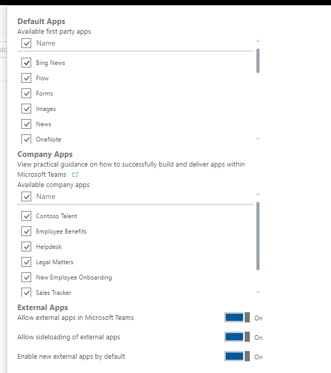

# 0-60: Get up and running with your very first Microsoft Teams app

## Overview and Introduction
In this lab, you will be getting your first app up and running in Teams. You should do this lab if:
- You have used Microsoft Teams
- You are interested in building apps or solutions for Teams, or Office 365 in general
- You have built Add-ins for Office or SharePoint

We will start with an app that provides basic bot and tab functionality already hosted on Azure. The lab will then include instructions for adding new functionality through the app’s manifest. For those who want to go further, you can add enhancements to the bot and deploy those changes to your own Azure subscription. 

The sample app we're using here manages the hiring process of candidates for open positions in a team – a Talent Management Application. While it looks good, the app doesn't actually do anything – we want to focus on building a Teams app and loading it into Teams, not creating a full-blown talent management application.

## Prerequisites
### Development tools
Please come with the following tools installed on your laptop:
- [Ngrok](https://ngrok.com/)
    - We recommend signing up for an account. Otherwise your tunnel will time out periodically and you will need to restart ngrok. Each time you restart, the tunnel endpoint changes.
- Visual Studio 2017
    - Install the "ASP.NET and web development" workload
- Microsoft Teams desktop client
- Browser of your choice

### Prepare your Office 365 environment
You must have an Office 365 tenant to complete this lab. If you don't have one, you can sign up for an Office 365 developer subscription by following the instructions [here](https://docs.microsoft.com/en-us/office/developer-program/office-365-developer-program-get-started).

>**IMPORTANT!** Because of limitations in Teams App Studio, a Microsoft Teams free tenant will **not** work for this lab. 

You will first need to enable side loading for Teams within your Office 365 environment. Open the Admin Center by visiting https://admin.microsoft.com/AdminPortal/Home#/Settings/ServicesAndAddIns from your browser.

Next, select Microsoft Teams. Under the Apps section, scroll down to External Apps and make sure that “Allow sideloading of external apps” is set to On.

